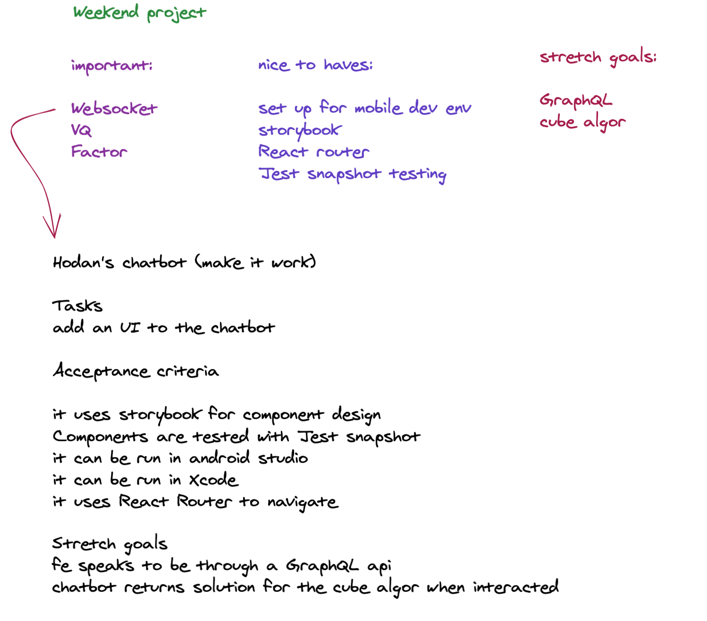

# A strange chatbot

This is a chatbot that responds to any questions with the solutions of the formula a^3 + b^3 = c^3 + d^3

## The idea

**original:** My colleague created this in order to practice WebSocket. [https://github.com/peach-bit/chatbot](https://github.com/peach-bit/chatbot)

**purpose:** To finish the unfinished tasks that I accumulated through the week. This is one of my first attempt to manage self-learning through [task reshuffling](https://github.com/lxierita/placement-retro/blob/4c6fe6fdeec4025e6a13e680a369996a966b241d/html/week15.html#L56-L64). 

### The planning behind

